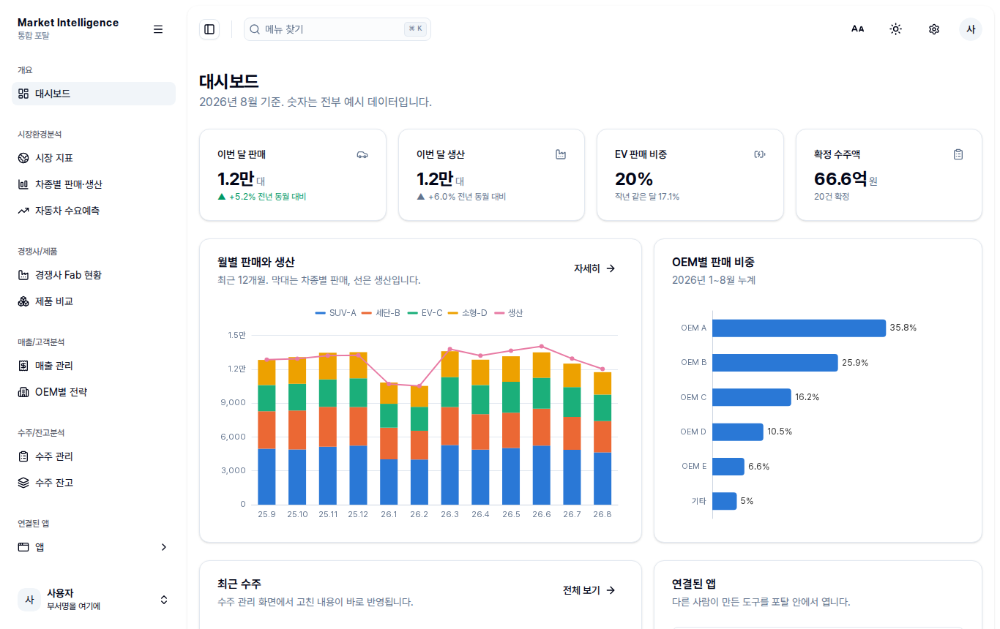
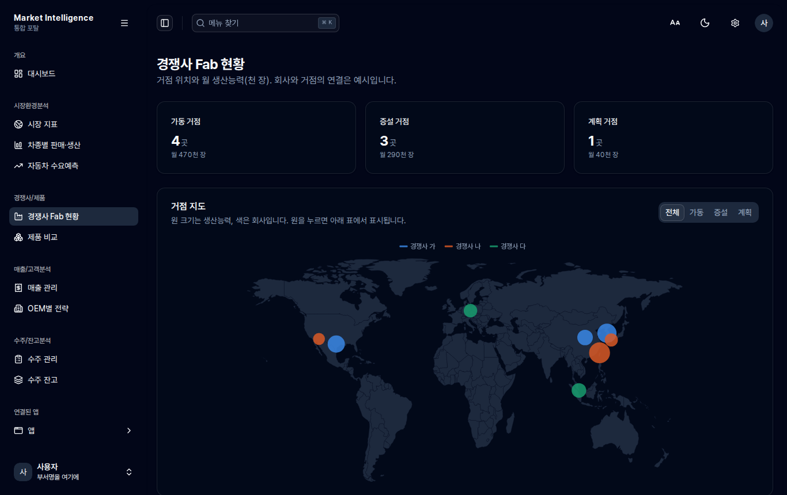

# mi-portal

Market Intelligence 통합 포탈 템플릿입니다. GitHub 에서 많이 쓰는 관리자 화면 템플릿
[shadcn-admin](https://github.com/satnaing/shadcn-admin) (MIT) 을 가져와 폐쇄망과 더블클릭 실행에 맞게 고쳤습니다.

사내 모델이 빈 폴더에서 화면을 새로 짜면 CSS 와 JS 를 직접 쓰는 단순한 결과가 나옵니다.
이 킷은 사이드바, 검색(Ctrl+K), 다크 모드, 표, 폼, 대화상자, 알림까지 이미 갖춘 상태에서 시작하므로
사내에서는 화면 내용만 채우면 됩니다.





## 바로 보기

`demo/index.html` 을 더블클릭하면 빌드된 포탈이 열립니다. 설치가 필요 없습니다.
`demo` 폴더는 이 커밋 시점의 빌드 결과이고, 코드를 고친 뒤에는 `build.bat` 으로 새로 만듭니다.

킷 폴더 맨 위의 `index.html` 은 개발용 원본입니다. 더블클릭하면 이 안내만 나오고 화면은 뜨지 않습니다.
화면을 보려면 `demo\index.html`, 직접 고친 뒤에는 `build.bat` 으로 만든 `dist-single\index.html` 을 엽니다.
빌드된 파일이 몇 초 안에 뜨지 않으면 화면에 오류 문구와 브라우저 정보가 나옵니다. Chrome 또는 Edge 111 이상이 필요합니다.

## 들어 있는 화면

| 메뉴 | 상태 | 내용 |
| --- | --- | --- |
| 대시보드 | 완성 | 판매, 생산, EV 비중, 확정 수주액 카드. 월별 판매 차트, OEM 비중, 최근 수주, 연결된 앱 |
| 시장환경분석 | 자리만 | 들어갈 내용과 엑셀 머리글 예시를 화면에 적어 두었습니다 |
| 경쟁사 Fab 현황 | 완성 | 세계 지도(인터넷 없이 뜸), 상태별 필터, 거점 표 |
| OEM별 전략 | 자리만 | |
| 차종별 판매·생산 | 완성 | 차종별 추이, 판매 대 생산 차이, 전년 대비 표, 엑셀 내려받기 |
| 수요예측 | 완성 | 6가지 방법을 최근 구간으로 검증해 가장 잘 맞힌 방법으로 예측 |
| 수주 관리 | 완성 | 정렬, 필터, 검색, 쪽 넘김, 여러 줄 선택, 추가/수정/삭제, 엑셀 가져오기와 내려받기 |
| 매출 관리 | 자리만 | |
| 연결된 앱 | 완성 | 다른 사람이 만든 앱을 포탈 안에 띄움. 면취수 계산기 예시 포함 |
| 글꼴과 테마 | 완성 | 밝게/어둡게, 글꼴, 사이드바 모양 |

숫자는 전부 만들어 낸 예시입니다. `src/data/mi-sample.js` 를 사내 데이터로 바꾸거나
엑셀 가져오기로 채웁니다.

## 사내에서 시작하는 순서

1. `mi-portal` 폴더를 통째로 한글과 공백이 없는 경로에 둡니다. 예: `C:\work\mi-portal`
2. `install.bat` 실행. 인터넷 없이 `vendor` 의 패키지로 설치하고 검사, 테스트, 빌드까지 한 번 돌립니다.
3. `dev.bat` 실행 후 브라우저에서 `http://localhost:5173` 을 엽니다. 코드를 고치면 바로 바뀝니다.
4. 사내 모델(ChatGPT Enterprise 또는 Cline)에 `prompts/` 의 프롬프트를 주고 화면을 하나씩 만듭니다.
5. `build.bat` 실행. `dist-single\index.html` 한 파일이 나오고, 이걸 배포합니다.

자세한 설치와 문제 해결은 [OFFLINE.md](OFFLINE.md), 사내 모델 사용법은 [prompts/README.md](prompts/README.md) 에 있습니다.

## 업데이트 받기

처음 한 번만 폴더를 통째로 옮기고, 그 뒤에는 바뀐 파일만 담은 zip 을 받습니다.
zip 과 목록은 저장소의 `updates/mi-portal/` 에 있습니다.

1. 킷 폴더의 `VERSION` 을 열어 지금 판을 확인합니다. 파일이 없으면 처음 판입니다.
2. `updates/mi-portal/README.md` 목록에서 "적용 전 판" 이 지금 판인 zip 을 받습니다.
   GitHub 에서 파일을 누르고 다운로드 단추(Download raw file)를 쓰면 저장소 전체를 받지 않아도 됩니다.
3. zip 을 아무 곳에나 풀고 안의 `apply.bat` 을 실행합니다. 킷 폴더 안에 풀 필요는 없습니다.
   `mi-portal` 폴더를 자동으로 못 찾으면 탐색기에서 그 폴더를 검은 창으로 끌어다 놓으라고 묻습니다.
   판이 맞으면 파일을 복사하고, 지워진 파일을 정리하고, `VERSION` 을 올립니다. 판이 안 맞으면 아무것도 바꾸지 않습니다.
4. 창에 나온 대로 `build.bat` 또는 `install.bat` 을 실행합니다. 바뀐 파일 목록은 zip 안의 `UPDATE.md` 에 있습니다.

여러 판을 건너뛰었으면 목록 순서대로 하나씩 적용합니다. 바뀐 파일이 40MB 를 넘는 업데이트는 zip 대신
목록에 "통째로 다시 받기" 로 적습니다.

## 구조

```
mi-portal/
  VERSION                           지금 판 번호. 업데이트 zip 을 고를 때 봅니다
  install.bat, dev.bat, build.bat   더블클릭용
  vendor/                           오프라인 설치용 패키지 tarball (윈도 x64, 리눅스 x64)
  tools/install-offline.cjs         vendor 로 설치 (install.bat 이 부름)
  demo/index.html                   빌드된 결과 미리보기
  prompts/                          사내 모델에 붙여 넣을 프롬프트
  tools/check.cjs                   빌드 전 검사 (없는 패키지, 외부 주소, 금지 import)
  tools/inline-build.cjs            빌드 결과를 HTML 한 파일로 합침
  public/apps/                      연결된 앱 파일 (포탈과 함께 배포)
  src/
    routes/_app/<메뉴>/index.tsx    주소와 화면 연결. 파일을 만들면 주소가 생깁니다
    features/<메뉴>/                화면 내용
    components/mi/                  MI 공용 부품: Chart, KpiCard, PageShell, PlannedPage
    components/ui/                  shadcn/ui 부품 (버튼, 표, 대화상자 등 30종)
    components/data-table/          정렬, 필터, 쪽 넘김이 붙은 표 부품
    components/layout/data/sidebar-data.ts   사이드바 메뉴
    config/apps.ts                  연결된 앱 목록
    lib/mi/                         숫자 표기, 수요예측, 공휴일, 엑셀, 차트 테마
    data/mi-sample.js               예시 데이터
```

## 원본 템플릿에서 바꾼 것

폐쇄망과 `file://` 실행 때문에 바꾼 것만 적습니다. 목록 전체는 [NOTICE.md](NOTICE.md) 에 있습니다.

- 주소를 `#/orders` 같은 해시 방식으로 바꿨습니다. 더블클릭으로 연 파일에서는 일반 주소 방식이 동작하지 않습니다.
- Google Fonts 대신 Pretendard 글꼴 파일을 넣었습니다. 빌드하면 HTML 안에 들어갑니다.
- 설정 저장을 쿠키에서 localStorage 로 바꿨습니다. `file://` 에서는 쿠키가 저장되지 않습니다.
- 빌드 결과를 HTML 한 파일로 합칩니다. Vite 기본 빌드는 `file://` 에서 빈 화면이 뜹니다.
- 로그인(Clerk), 채팅, 사용자 관리 같은 예시 화면을 지우고 MI 화면으로 바꿨습니다. 화면 문구는 한국어입니다.
- 차트는 Recharts 대신 ECharts 로 통일했습니다. 세계 지도와 기간 확대가 필요해서입니다.
- 테스트는 Vitest 대신 Node 에 들어 있는 `node --test` 를 씁니다. 설치할 것이 줄어듭니다.

## 알아 둘 한계

- 포탈은 각자 PC 에서 파일로 여는 구조라 서버가 없습니다. 수주 관리에서 고친 내용은 그 PC 브라우저에만
  저장되고 다른 사람에게 보이지 않습니다. 공유할 데이터는 공유 폴더의 엑셀을 원본으로 두고
  가져오기와 내려받기로 주고받습니다.
- 빌드 결과는 약 3.5MB 입니다. ExcelJS(약 1MB)와 ECharts, 글꼴이 대부분입니다.
- 예시 앱(면취수 계산기)은 포탈의 테마 메시지를 받지 않고 윈도 설정을 따릅니다.
  앱이 포탈 테마를 따르게 하는 방법은 저장소의 `docs/app-integration.md` 에 있습니다.
